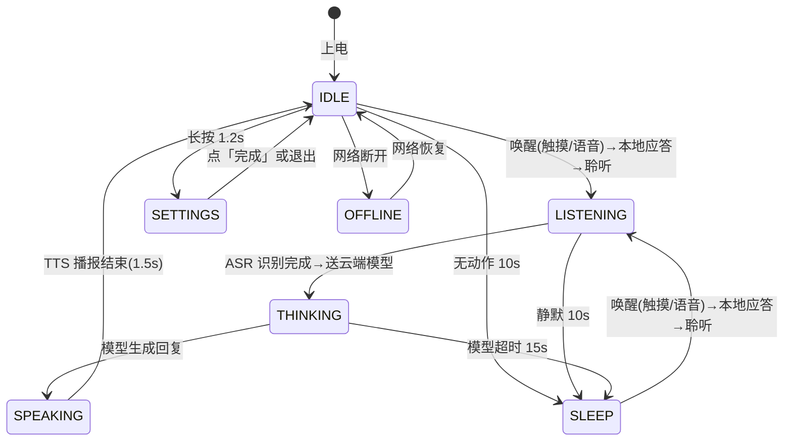
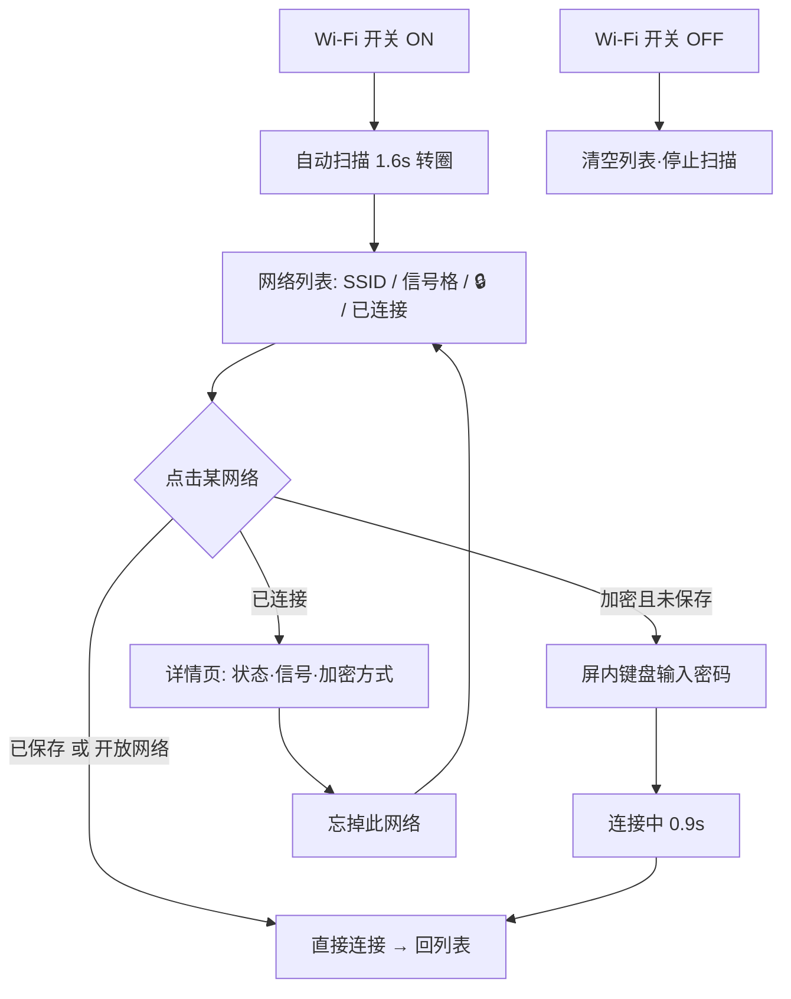
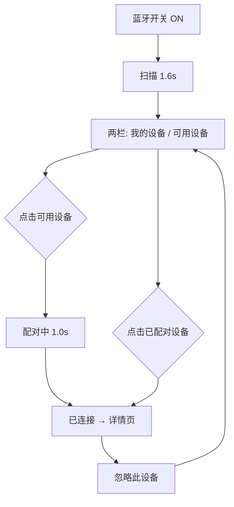
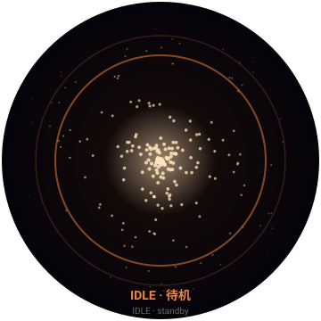
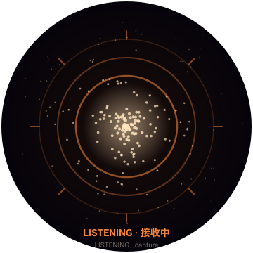
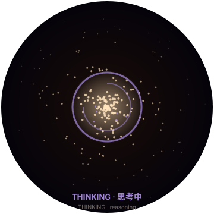
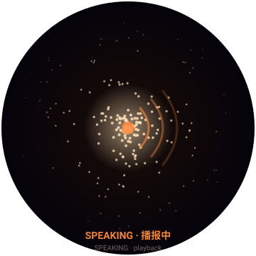
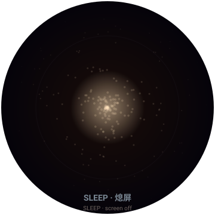
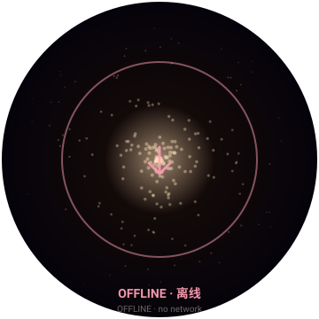
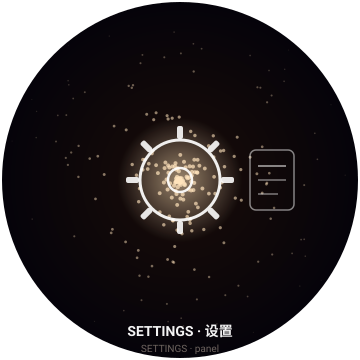

# CIRA 设备端 HMI 开发交付规格书

> 版本：v0.6.1 ｜ 日期：2026-08-07 ｜ 适用：360×360 圆形屏设备（ESP32 + 圆形 LCD/AMOLED）
> 本文是 **设计原型 → 嵌入式/HMI 开发** 的移交文档。Web 原型仅作交互参考，**不可直接刷到设备**；开发须按本文把交互、视觉、数据流翻译为 C/LVGL（或厂商 SDK）实现。

---

## 0. 交付清单（开发按这张表收文件）

| 文件 | 用途 | 开发是否必读 |
|---|---|---|
| **HANDOFF.md**（本文） | HMI 规格 + 集成指南 + 移植参数 | ✅ 必读 |
| `index.html` | 页面结构与全部 DOM 节点 ID（实现时一一对应） | ✅ 必读 |
| `styles.css` | 布局/尺寸/安全区/设计令牌（数值直接照搬） | ⚠️ 参考 |
| `app.js` | 状态机 + 各设置链路的交互逻辑（流程参考） | ✅ 必读 |
| `lifeform.js` | 星云视觉引擎，含**全部可调参数**（移植参照） | ✅ 移植必读 |
| `assets/state_*.svg` | 每态渲染目标参考图（IDLE/LISTENING/THINKING/SPEAKING/SLEEP/OFFLINE/SETTINGS） | 选读（对照用） |
| `README.md` | 项目概述与运行方式 | ⚠️ 参考 |
| `PROJECT_CONTEXT.md` | 项目来龙去脉与决策记录 | 选读 |

> 浏览器打开 `index.html`（或本机 `localhost:8080`）即可**亲手点一遍**当前 UX，是最快建立共识的方式。

---

## 1. 设备与目标平台

| 项 | 规格 |
|---|---|
| 屏幕 | 圆形，直径 **360×360 px**（物理像素，建议 1x 渲染，无需 DPR 倍率） |
| 安全区 | 四角被圆形裁切。内容可用区：水平 **244px 宽**、上下各留 **≈46px**（顶部放字幕、底部放按钮） |
| 主控 | ESP32（推测）；渲染建议 LVGL / 厂商 GUI 库，圆形 `clip` 裁切 |
| 状态指示 | 设备端无独立指示灯，状态靠**中心光生命体形态 + 颜色**表达（见 §5） |
| 音频 | 麦克风输入（ASR）、扬声器输出（TTS）——接口由底层模型层提供 |

> 原型中圆形裁切在 `lifeform.js` 第 482–485 行（`ctx.arc(...); ctx.clip()`），开发须为所有 UI 层同样做圆形 `clip`，否则内容会溢出圆角。

---

## 2. 状态机（State Machine）

设备核心状态：**IDLE / LISTENING / THINKING / SPEAKING / SETTINGS / OFFLINE / SLEEP**。



> **唤醒优先级最高**：在 LISTENING / THINKING / SPEAKING 任意态再次触发唤醒，都会立即打断当前一切输出（含正在播报的 TTS），先播放本地应答、再重新进入 LISTENING 接收下一段语音。详见 §3.1 与 §3.7。

### 状态 → 视觉参数映射（传给 `lifeform.js`）

| 状态 | 光生命体形态 | 颜色 | 字幕显示 |
|---|---|---|---|
| IDLE | 缓慢呼吸球（sphere） | 暖白 `#FFE3BC` | 不显示 |
| LISTENING | 外扩散开（scatter）+ 声波环 | 暖橙 `#FF8A3D` | 显示（接收态，较暗） |
| THINKING | 内聚漩涡（vortex） | 紫 `#A98CE0` | 不显示 |
| SPEAKING | 纵向声波起伏（wave） | 暖橙 `#FF8A3D` | 显示（输出态，正常亮） |
| OFFLINE | 下沉暗淡（droop） | 暖白弱化 `#D8C0A8` | 显示「离线」提示条 |
| SETTINGS | 暂停主态，显示设置浮层 | 白 `#FFFFFF` | 不显示 |
| **SLEEP** | **熄屏（engine.pause()，清屏 + 亮度遮罩 100%）** | **全黑** | **不显示** |

---

## 3. 屏幕与交互规格

### 3.1 主屏（Home）
- **中心**：光生命体引擎（见 §5），铺满圆形。
- **字幕（subtitle）**：位于圆屏上方安全区内，**版心宽 208px、字号 13px、最多 3 行**，超出省略不溢出。
  - 接收态（LISTENING）加 `.listening` 类 → 颜色更暗（`--c-text-dim`）、字号 12.5px，与输出态视觉区分。
- **唤醒（统一入口 `wake()`）**：触摸圆屏任意位置，或说唤醒词 **“你好，cira”/“你好，西拉”**，立即按顺序发生：
  1. 播放**本地应答**（预录 vivi2.0 语音「我在。」/「哎！」随机二选一；原型无音频文件时用 TTS 兜底）——**此应答不进大模型**，纯设备端；
  2. 进入 `LISTENING`，正式接收用户语音，之后才把语音 / ASR 文本**送云端模型**生成回复。
  - 底部「麦克风按钮」可点按 **开/关** 语音唤醒（默认开）；不支持语音识别的浏览器降级为「点话筒模拟唤醒」。
  - **唤醒优先级最高（打断语义）**：在 LISTENING / THINKING / SPEAKING 任意态再次唤醒（触摸或说唤醒词），会**立即打断当前一切输出**（含正在播报的 TTS），先播放本地应答，再重新进入 LISTENING 准备接收下一段输入。典型场景：设备正在回答，用户不满意，再说“你好，cira” → 立刻停掉当前回答、回“哎！”、等待新指令。
  - 完整行为规格见 §3.8。
- **端侧唤醒词引擎（已决策，v0.4.1）**：选用 **Espressif ESP-SR / WakeNet**——ESP32 官方离线唤醒引擎，免费、低功耗、支持中文，与本设备 ESP32 平台契合度最高；若后续主控非 ESP32，备选 **Picovoice Porcupine**（跨平台、端侧、可定制唤醒词）。**当前阶段固定两个唤醒词「你好，cira / 你好，西拉」，不做自定义/多语言**——产品仍在跑通验证期，确认多语言需求后再评估扩展。引擎选型理由与移植要点见 §8.1。
- 长按 1.2s（pointerdown 计时 `LONG_PRESS_MS = 1200`）→ 进入 SETTINGS。

### 3.2 设置（Settings / 多视图导航）
进入 SETTINGS 显示半透明磨砂浮层（圆屏内），内部用 **view stack** 导航，主菜单 5 项：

```
主菜单(home)
 ├─ Wi-Fi        → wifi 视图
 ├─ 蓝牙         → bluetooth 视图
 ├─ 音量         → volume 视图
 ├─ 屏幕亮度     → brightness 视图
 └─ 模式         → mode 视图
底部：[完成] 返回主屏
```

导航方式：`gotoView(name)` 压栈，返回上一级 `backView()`，转场 0.22–0.25s 横向滑入/滑出。开发只需保证「菜单→子页→返回」层级可达即可，具体过场动画可简化。

---

### 3.3 Wi-Fi 完整链路



- **开关**：`#wifi-switch`（checkbox），ON 即触发扫描。
- **扫描**：模拟 1.6s 转圈（`#wifi-scan-row` spinner），完成后渲染列表。
- **网络列表**：按「已连接置顶 → 信号强→弱」排序；每项显示 信号格(3档 `●○`) / 🔒锁标（仅加密）/ 「已连接」徽标。
- **连接判定**：已连接→进详情；已保存或开放网络→直连；加密未保存→进密码页。
- **密码输入**：屏内键盘（见 §4），大小写切换 `⇧`、删除 `⌫`、明文切换 `👁`，上限 32 字符。
- **详情页**：网络名 / 状态(已连接) / 信号(强·中·弱) / 加密(WPA2/WPA/无)。
- **忘掉此网络**：清 `saved` 标记，若当前已连接则该项断开，回列表。

---

### 3.4 蓝牙完整链路



- **开关**：`#bt-switch`，ON 即扫描并渲染列表。
- **两栏**：`#bt-paired`（我的设备）/ `#bt-available`（可用设备，排除已配对）。
- **配对**：点可用设备→「配对中 1.0s」→ 设为已连接（同时断开其它已连接设备）→ 进详情。
- **详情页**：设备名 / 状态(已连接·已配对未连接) / 类型(音频设备·耳机·显示设备·穿戴设备)。
- **忽略此设备**：从已配对移除，回列表。

---

### 3.5 音量与屏幕亮度（滑杆）

| 项 | 范围 | 默认值 | 行为 |
|---|---|---|---|
| 音量 | **0–100** | 60 | 拖动实时改；0 = 静音 |
| 屏幕亮度 | **1–400 nit** | 200 | 拖动实时改；驱动整屏变暗遮罩 |

**亮度遮罩规则（关键，需照搬手感）**：
- 200–400 nit：**屏幕保持通透，不压暗**（避免白白吃掉星云效果）。
- 低于 200 nit：按 `op = (200 - nit) / 200 × 0.8` 逐渐变暗，最暗保留 0.8 不透明度（不致全黑）。
- 行业参考：儿童设备夜间最低 ~1 nit 防刺眼；室内正常 150–250 nit；强光环境上限 ~400 nit。

> 亮度遮罩是覆盖全屏的黑色层 `#brightness-overlay`，`z-index` 高于设置面板，所以拖动时整屏实时变暗（与真机一致）。

---

### 3.6 模式（Mode）
三选一：**正常 / 安静 / 故事**，单选 `.opt-item[data-mode]`，选中态高亮并更新主菜单值标签。模式不影响视觉引擎，由底层模型层解释（影响回复风格/音量策略）。

### 3.8 唤醒应答（本地，非大模型）— v0.6 明确

**设计原则**：唤醒瞬间给用户的"我在。/哎！"是**设备端固定应答**，与对话内容无关，**不经过大模型**。这样做的目的：
- 唤醒响应零延迟（本地音频直接播），体验更跟手；
- 省电省流量（不必为"应答一声"发动一次云端推理）；
- 与"正式对话"（送云端模型）在架构上分层清晰。

**规格**：

| 项 | 值 |
|---|---|
| 应答词 | 「我在。」/「哎！」二选一（随机，可加权） |
| 音频文件 | `assets/wake_wo.mp3`（我在。）、`assets/wake_ai.mp3`（哎！），**预录 vivi2.0 音色** |
| 兜底 | 无音频文件时，用设备 TTS（zh-CN）播同一文本，保证可演示 |
| 触发 | 任何 `wake()` 入口（触摸 / 语音 / 调试按钮），每次唤醒播一次 |
| 显示 | 同步在字幕区显示该应答词（接收态样式），让用户看到"设备在回应" |
| 后续 | 应答播完后 `LISTENING` 才开始收声 → ASR → 送云端模型 |

**与云端模型的分界（关键）**：
- 唤醒 → 本地应答：**不联网、不进模型**。
- 本地应答播完 → 进入聆听：**此时用户说的下一句话**才送云端模型得到回复。
- 因此"唤醒词的应答"和"对话回复"是两次独立事件，不要合并。

**打断优先级**（开发务必实现）：`wake()` 应作为最高优先级中断。当设备处于 SPEAKING（正在 TTS 播报）或 THINKING（模型推理中），收到新的 `wake()` 必须：① 立即 `cancel` 当前 TTS / 丢弃未发出回复；② 播放本地应答；③ 进入 LISTENING 等待下一段输入。真机靠 **AEC（回声消除）** 防止设备自身 TTS 被当作唤醒词；原型可用「触摸 / 调试面板唤醒按钮」演示该打断。

### 3.7 SLEEP 熄屏省电（v0.5 新增）

**目的**：解决 ESP32 上星云粒子持续渲染的功耗问题。无交互时主动熄灭屏幕，仅保留麦克风被动监听唤醒词，把整机功耗降到 IDLE 的 ~5–10%。

**触发时机（进入 SLEEP，v0.6 定为 10s）**：
- `IDLE` 无动作/交互超时（默认 **10 s**）→ SLEEP
- `LISTENING` 静默（无语音输入）超时（默认 **10 s**）→ SLEEP
- `THINKING` 模型超时无响应（默认 **15 s**）→ SLEEP
- `SPEAKING` 播报结束 → IDLE → 10 s → SLEEP（两级超时，避免立刻灭屏让用户感到突兀）

**唤醒路径（离开 SLEEP，与「活跃态唤醒」完全一致）**：
- **触摸唤醒**：任意位置触摸 → 播放本地应答（我在。/哎！）→ 进入 `LISTENING` 接收语音。
- **语音唤醒**：唤醒词命中 → 同样播放本地应答 → 进入 `LISTENING`。
- 即 SLEEP 被点亮的方式与普通「唤醒」完全相同（统一 `wake()` 入口），**不单独回 IDLE 再对话**。
- **设置快捷入口**：「长按 1.2s 进 Settings」在 SLEEP 唤醒后的 IDLE/聆听态照常生效。

**唤醒优先级（打断语义，v0.6 明确）**：
- 唤醒（`wake()`）优先级高于一切：在 LISTENING / THINKING / SPEAKING 任意态再次唤醒，**立即打断当前输出**（含正在播报的 TTS），先播本地应答，再重新进入 LISTENING 等待下一段输入。
- 典型场景：设备正在回答，用户再说“你好，cira” → 立刻停掉回答、回“哎！”、准备接收新指令。
- 真机靠 AEC（回声消除）保证设备自身 TTS 不会误触发唤醒；原型中可用「触摸 / 调试面板唤醒按钮」演示打断。

**视觉/渲染**：
- 引擎调用 `engine.pause()`，**完全跳过粒子更新与绘制**，节省 CPU/GPU。
- 屏幕亮度遮罩强制 100% 不透明（黑色全屏），等同物理熄屏。
- 字幕/呼吸光环/麦克风按钮**全部隐藏**。
- 麦克风**保持被动监听**（低占空比采样，仍能识别唤醒词）。
- 退出 SLEEP 时引擎 `engine.resume()`，按 IDLE 状态平滑接入。

**调试面板**：右侧新增「模拟 SLEEP」按钮，开发可手动触发/恢复，便于功耗测试。

> **为什么不进 SETTINGS 后再 SLEEP**：SETTINGS 是用户主动行为，结束直接回 IDLE 即可，不进 SLEEP（用户可能继续调参数）。

---

## 4. 屏内键盘（密码输入）

布局（4 行，原型 `KP_ROWS`）：

```
1 2 3 4 5 6 7 8 9 0
q w e r t y u i o p
a s d f g h j k l
⇧ z x c v b n m ⌫
```

- `⇧` 切换大小写（实时重建键盘，字母显示大写）。
- `⌫` 删一字。
- `👁` 切换明文/密文（密文显示 `•` 掩码）。
- 输入上限 32 字符。
- 底部 [取消] / [连接] 按钮。

---

## 5. 视觉引擎（星云）移植规格

星云 = **成千上万颗锐利小星点，靠"密核→稀边"的密度梯度堆叠出朦胧感**；**不使用大范围柔光斑**。这是 v0.2→v0.3 的核心调整（用户明确要"星云"而非"光斑"）。

### 5.1 粒子分布（4 层 3D 球面 + 透视）

| 层 | 数量(×density) | 半径区间(r) | 单颗尺寸 | 噪声流 | 旋流 | 角色 |
|---|---|---|---|---|---|---|
| 0 核心尘 | 420×d | 0.030–0.130 | 0.45–1.15 | 1.35 | 1.55 | 最密，堆出中心亮 |
| 1 主体星云 | 560×d | 0.130–0.270 | 0.40–1.00 | 0.85 | 1.00 | 主体 |
| 2 游离星尘 | 280×d | 0.270–0.420 | 0.34–0.85 | 0.45 | 0.55 | 更稀疏 |
| 3 外场散星 | 140×d | 0.420–0.500 | 0.30–0.70 | 0.30 | 0.35 | 极稀疏边缘 |

- **总粒子 ≈ 1400 × density**（density 默认 1.0，调试 0.3–2.0）。
- **分布**：Fibonacci 球面采样（`GOLDEN = π(3−√5)`）保证方向均匀不结块；每点加 ±0.16 抖动。
- **3D→2D**：绕 Y 轴旋流 + 透视 `persp = 1/(1 − z·0.36)`（z 越靠前越大越亮）。
- **内腔**：r0 从 0.030 起，中心留空腔让光从雾核透出（避免"一坨糊中间"的扁平感）。

### 5.2 星点精灵（sprite）轮廓

单颗是**锐利星点**，不是柔斑。径向渐变停靠点（半径 0→1）：

```
0.00 → 不透明(1.0)
0.10 → 0.95      ← 亮核收到 0.10 内即接近实心
0.24 → 0.42
0.42 → 0.11
0.66 → 0.018     ← 0.66 后基本熄灭 → 单颗是"点"不糊
1.00 → 0
```

- **预渲染**：每色一个 64×64 离屏 sprite，避免每帧重画渐变（关键提速）。
- **色散**：70% 主色 / 18% 暖橙 `#FF8A3D` / 12% 软粉 `#FF9EB5`。
- **渲染直径**：`d = max(1.3, size × persp × (0.6 + depth×0.8) × 3.1)` px（已较 v0.2 砍半，单颗最小 1.3px）。
- **合成**：`globalCompositeOperation = 'lighter'`（加色），重叠自然变亮。

### 5.3 中心雾核（减弱）

- 仅 2 层极淡底辉（半径 `0.050 / 0.095 × w`），亮度 `0.11 / 0.075 × coreGlow`。
- 最内亮核半径 `0.022 × w`，不透明度 `coreGlow × 0.30`（只是"光源暗示"，真亮靠核心尘粒子）。
- 中心真正的亮由密集核心尘（layer 0）堆叠形成。

### 5.4 拖尾层（光轨）

- 离屏 `trail` 层，每帧先 `destination-out` 擦掉 `(1 − e^(−dt × trailFade))` 比例 → 光轨残影。
- 之后全部 `lighter` 叠加。
- `trailFade` 按状态 4.5–9.5（越小拖尾越长）。

### 5.5 状态形态参数（STATE_PROFILE）

| 状态 | breath | spread | coreGlow | swirl | flow | morph | trailFade | gain | sag |
|---|---|---|---|---|---|---|---|---|---|
| idle | .040 | 1.00 | .55 | .055 | .42 | sphere | 7.5 | 1.00 | 0 |
| listening | .060 | 1.20 | .72 | .160 | .78 | scatter | 9.5 | 1.12 | 0 |
| thinking | .028 | .88 | .88 | .620 | .98 | vortex | 5.5 | 1.05 | 0 |
| speaking | .070 | 1.06 | .76 | .100 | .66 | wave | 8.5 | 1.10 | 0 |
| offline | .030 | .78 | .20 | .018 | .20 | droop | 6.0 | .38 | 22 |
| wake | .100 | 1.34 | .98 | .340 | 1.15 | burst | 4.5 | 1.30 | 0 |
| **sleep** | **—** | **—** | **—** | **—** | **—** | **—** | **—** | **—** | **—** |

> SLEEP 不参与形态插值——引擎调用 `engine.pause()` 完全跳过渲染，故所有参数均不适用。`gain` 与 `coreGlow` 实际等价于 0。

- 状态切换用**指数平滑插值**（`km = 1 − e^(−dt·2.6)`），"化"过去不跳变。
- 颜色切换同样指数平滑（`k = 1 − e^(−dt·3.2)`）。
- 形态调制（morph）：scatter 随音量外扩；vortex 内聚旋涡；wave 纵向声波；droop 下沉暗淡；burst 唤醒猛扩。

### 5.6 背景与暗角

- 背景：极暗暖底径向渐变（中心 `rgba(26,13,8,.62)` → 边缘全黑）。
- 暗角（vignette）：`0.34w→0.50w` 渐黑 0.20→0.62，增强体积感（不压掉外层星尘）。
- 以上为静态层，仅 resize 时重建。

### 5.7 性能预算（ESP32 目标）

| 项 | 目标 |
|---|---|
| 帧率 | ≥ 30 FPS（理想 60） |
| 粒子数 | ≈ 1400（density 1.0）；低端芯片可降到 600–800 保帧 |
| 关键点 | sprite 预渲染、拖尾层离屏、`lighter` 合成、背景/暗角静态化 |
| 渲染分辨率 | 360×360（1x），圆形 clip |

---

## 6. 设计令牌（Design Tokens）

| 令牌 | 值 | 说明 |
|---|---|---|
| 背景底 | `#0A060E` → 中心 `#1A0D08` | 极暗暖底 |
| 核心光 | `#FFE3BC` | 暖白（偏橙，避开屏幕色温推成绿） |
| 暖橙 | `#FF8A3D` | idle/listening/speaking |
| 软粉 | `#FF9EB5` | comfort/offline 点缀 |
| 紫 | `#A98CE0` | thinking |
| 文字主 | `--c-text`（暖白） |  |
| 文字次 | `--c-text-dim` | 接收态字幕、值标签 |
| 边框 | `--c-border`（低透白） |  |
| 圆屏直径 | 360px |  |
| 内容宽 | 244px | 安全区内 |
| 字幕 | 208px 版心 / 13px / 3 行 | 不溢出 |

> **配色铁律**：全暖色系，**绝不允许出现绿色**。绿来自早期屏幕色温偏差，已用暖白核心 `#FFE3BC` 根治。

---

## 7. 与底层模型的数据契约

设备 UI 不产内容，全部来自「底层模型层」（对话/语音模型）。约定如下接口：

### 7.1 模型 → 设备（UI 需要）

| 事件/数据 | 字段 | 触发 |
|---|---|---|
| 唤醒 | `wake {reason: 'touch'\|'voice'\|'button'}` | 用户点按 / 唤醒词命中；**优先级最高，可打断 SPEAKING** |
| 唤醒应答(本地) | `wake_ack {phrase: '我在。'\|'哎！'}` | 唤醒瞬间播放的**本地预录语音**（vivi2.0），不进大模型；UI 同步显示该词 |
| 进入聆听(收声) | `listening` | `wake_ack` 播完后进入；模型开始收声 |
| 用户语音(ASR) | `asr_text: string` | 识别完成后 LISTENING 字幕显示；**这段文本才送云端模型** |
| 回复文本(TTS) | `tts_text: string` | 云端模型返回，SPEAKING 字幕显示并 TTS 播报 |
| 播报进度 | `tts_progress: 0..1` | 驱动声波/明灭 |
| 输入音量 | `audio_level: 0..1` | 驱动聆听态外扩 |
| **进入睡眠** | `enter_sleep` | 无动作 10s 自动发起，告知模型停止收发，进入低功耗 |
| **离开睡眠** | `leave_sleep {reason}` | 触摸/语音唤醒后告知模型 |
| 网络状态 | `online / offline` | 切 OFFLINE 态 |

### 7.2 设备 → 模型（回传）

| 事件 | 字段 | 说明 |
|---|---|---|
| 进入聆听 | `state=listening` | 模型开始收声 |
| 设置变更 | `volume: 0..100` `brightness: 1..400` `mode: normal\|quiet\|story` | 持久化到设备 |
| Wi-Fi 凭据 | `wifi:{ssid, password}` | 交给设备 Wi-Fi 栈 |
| 蓝牙指令 | `bt:{action: connect\|forget, name}` | 交给设备 BT 栈 |

> 原型中用**模拟脚本**驱动（随机 ASR/TTS 文本 + 计时切态），开发接入真实模型时替换 `beginListen / onAsrDone / speakScript` 三处即可（唤醒应答 `wake()` 与 SLEEP 逻辑属设备端固定行为，保持不变）。

---

## 8. 待确认项（Open Questions）

1. **Wi-Fi/蓝牙栈**：ESP32 是否跑真实 `esp-wifi` / `esp-bt`？还是由配套 MCU/手机配网？决定设置页数据从哪来。
2. **亮度映射**：200 nit 为"通透阈值"是产品手感取舍，需硬件确认 LED 实际 nit 区间。
3. **音频输入**：麦克风 ASR 在端侧还是上云？影响唤醒→聆听延迟。
4. **控制中心形态**：当前为「长按→设置浮层→多视图导航」。用户提及更想要「iOS 控制中心式：主屏快捷开关 + 长按开关弹悬浮详情页」。**此改动列为后续候选**，本次交付以现有多视图为准。
5. **字体**：中文字体需硬件字体库支持（思源/系统字体），原型用系统中文 fallback。
6. **SLEEP 超时参数（v0.6 已定为 10s）**：无动作/交互 10s 自动熄屏已写入规格与代码；保留以下开放点：
   - THINKING → SLEEP（模型超时）：**15 s**（防模型卡死，仍待硬件确认）
   - 是否提供"儿童锁/家长锁"屏蔽 SLEEP（例如夜间讲故事模式不熄屏）？

### 8.1 已决策（v0.4.1，AI 代为拍板）

- **语音唤醒引擎**：选 **Espressif ESP-SR / WakeNet**（ESP32 官方离线唤醒，免费、低功耗、支持中文）。备选 **Picovoice Porcupine**（跨平台、可定制唤醒词）用于非 ESP32 主控。
  - 选型理由：① 设备主控即 ESP32，WakeNet 是官方维护、零授权费、专为 ESP32 优化的离线唤醒方案；② 儿童设备隐私要求麦克风**端侧常驻**、不上云，WakeNet 完全离线；③ 中文唤醒词支持成熟，社区案例多。Porcupine 虽唤醒率更高且支持定制，但商用授权费、且跨平台会引入非 ESP32 依赖，故列为备选。
  - 移植要点：由 ESP-SR 的 AFE（声学前端）做降噪/回波消除 → WakeNet 做关键词检测；命中后向主循环发 `wake` 事件（与 §7.1 一致）。两个唤醒词需分别注册为两个关键词模型或合并为一个二选一命令词。
  - **唤醒词固定**：仅「你好，cira / 你好，西拉」两个，**本阶段不做自定义/多语言**（产品验证期，避免过早抽象）。多语言/自定义需求明确后再评估换 Porcupine 或自训。

---

## 9. 如何运行参考原型

```bash
cd cira-prototype
python3 -m http.server 8080
# 浏览器打开 http://localhost:8080
```

- 短按圆屏 → 唤醒对话（模拟）；说 **“你好，cira” / “你好，西拉”** → 语音唤醒（Chrome 需允许麦克风；其它浏览器降级为点话筒模拟）
- **长按圆屏 1.2s** → 进入设置（若页面像"纯文字堆叠无样式"，是浏览器缓存了旧 CSS，按 Cmd+Shift+R 硬刷）
- 右侧调试面板：手动切状态/情绪、注入字幕、调粒子密度

---

## 10. 版本与变更

- **v0.1** 初版（扁平光圆）
- **v0.2** 体积粒子光场（去扁平）
- **v0.21** 缩小粒子+增数量（减模糊）
- **v0.3** 星云化（锐星点+~3×数量+½尺寸+弱中心雾）+ 设置全链路（Wi-Fi/蓝牙/音量/亮度/模式）+ 字幕版心约束 ＋ 本交付文档
- **v0.4** 语音唤醒（第二种唤醒方式）：唤醒词"你好，cira / 你好，西拉"，待机被动聆听 + 麦克风按钮开关
- **v0.4.1** 语音唤醒引擎决策：ESP-SR/WakeNet（ESP32 官方离线），固定唤醒词、暂不做自定义/多语言；从待确认项移入"已决策"
- **v0.5** SLEEP 熄屏省电状态（解决星云持续渲染的高功耗）：新增 SLEEP 状态 + 触摸/语音两条唤醒路径 + 引擎 pause/resume 机制；§2 状态机/§2 视觉映射/§3.7 行为/§5.5 形态表/§7.1 数据契约/§8 超时参数/§10 同步
- **v0.6** 唤醒交互重构：① 无动作/交互 **10s** 自动熄屏省电；② 唤醒播放**本地应答**「我在。」/「哎！」（vivi2.0 预录，TTS 兜底，不进大模型）；③ **唤醒优先级最高**，可打断 SPEAKING 立即回应用户（典型：正在回答时再说"你好，cira" → 停掉回答、回"哎！"、准备接收下一段）；④ 语音/触摸任意态唤醒 → LISTENING → 送云端模型；⑤ 新增每态**静态参考图集**（`assets/state_*.svg` + §11）
- **v0.6.1** Bug 修复：修正 SLEEP 唤醒后屏幕**永久黑屏**。`transition()` 离开 SLEEP 时，`currentState` 尚未更新为下一态就调用 `setBrightness()`，而该函数内的 `currentState !== SLEEP` 守卫误判"仍在熄屏"并跳过遮罩复位，导致全黑遮罩（`opacity:1`）残留、无论怎么点都不亮。修复：离开 SLEEP 分支先 `currentState = next` 再 `setBrightness()`，守卫放行、遮罩正常还原；同时版本戳 `?v=0.6.1` 强刷缓存。

---

## 11. 渲染目标参考图集（开发对照）

> 下列 7 张为**星云视觉的渲染目标参考图**（SVG，矢量可无损缩放）。开发移植到 LVGL / 厂商 SDK 时，把它们当作"做出来长这样"的校准基准——参数表在 §5，二者结合使用。
> 图与 §5 的"密核→稀边"密度梯度一致：中心星光最密最亮，越靠边缘越稀疏越暗。**全暖色、无绿**。
> 注：SLEEP 屏为近黑、仅余极淡星点（dim 0.22），图已体现。

| 状态 | 参考图 | 视觉要点 |
|---|---|---|
| IDLE 待机 |  | 缓慢呼吸球；暖橙外环；中心亮核 |
| LISTENING 接收中 |  | 3 圈同心声波环 + 8 向辐射刻；暖橙 |
| THINKING 思考中 |  | 紫色内聚环 + 旋弧 + 中心紫星簇 |
| SPEAKING 播报中 |  | 中心发声点 + 右侧 3 道声波弧；暖橙 |
| SLEEP 熄屏 |  | 近黑、极淡星点；几乎不可见（省电） |
| OFFLINE 离线 |  | 软粉环 + 下沉箭头；提示断网 |
| SETTINGS 设置 |  | 白色齿轮暗示 + 设置面板轮廓 |

> 参考图仅表达"光生命体形态 + 配色 + 状态识别度"，不含字号/布局等 UI 细节（那些见 §3 与 §6）。若视觉方向与 §5 参数有出入，以参数表为准、并同步修订本图。
